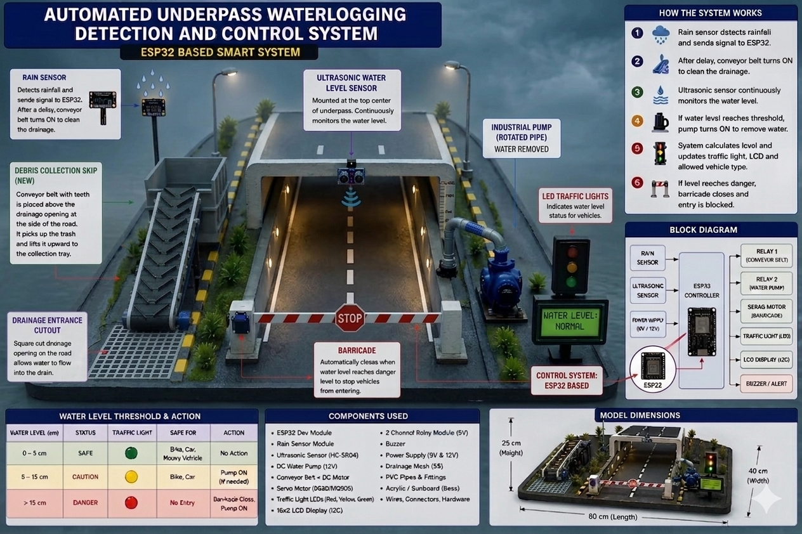
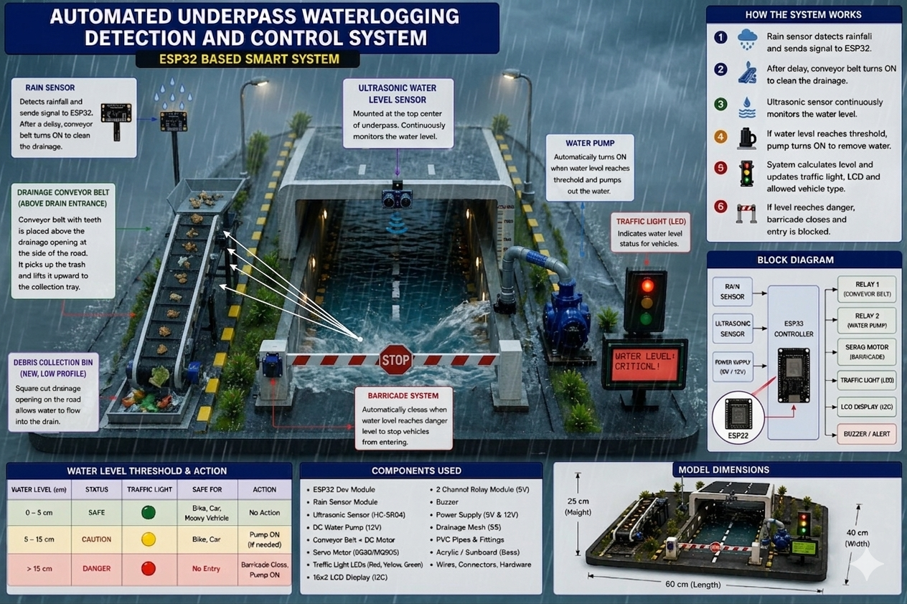
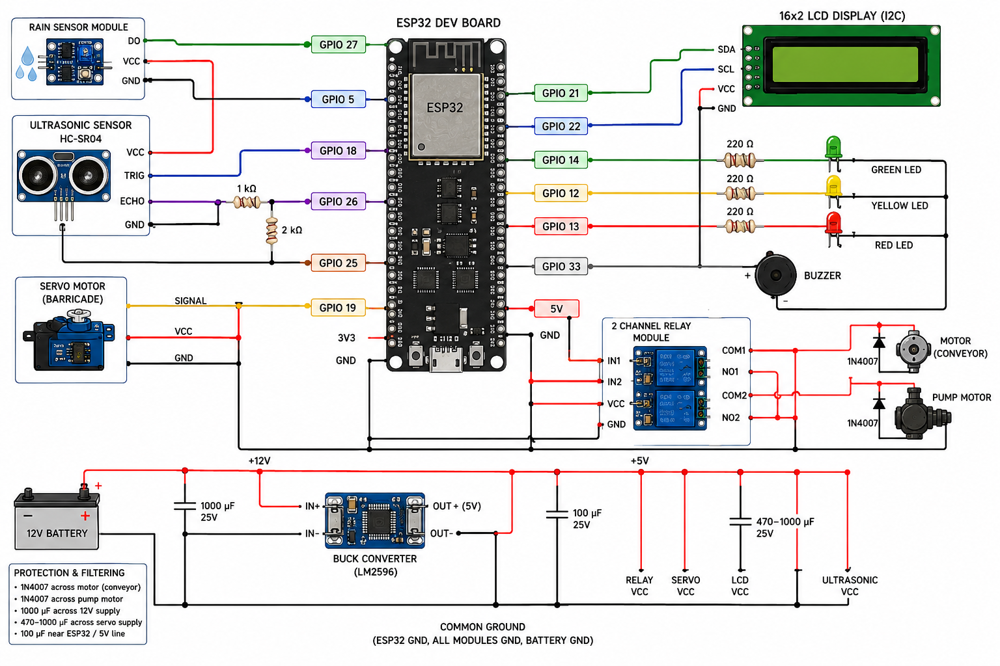

# 🛣️ Automated Underpass Waterlogging Detection & Control System

[](./LICENSE)
[](https://github.com)
[](https://github.com)

A smart, automated IoT and embedded system built on the **ESP32 microcontroller** platform. It is designed to detect rainfall, monitor real-time water accumulation levels, clear drainage blockages using a motorized conveyor mechanism, and automatically pump out water to prevent underpass flooding. 

The system enhances public road safety by deploying a servo-operated physical barricade to restrict vehicular entry during dangerous high-water conditions while providing real-time alerts via an LCD, status LEDs, and an audible buzzer.

---

## 📸 Project Media

Below is the physical hardware setup, 3D renders, and circuit assembly for this project:

### 📐 Structural Design & 3D Modeling

| Perspective View 1 | Perspective View 2 |
| :---: | :---: |
|  |  |

### ⚡ Electronics & Wiring Schematic


### 🛠️ Hardware Implementation Setup


---

## 🛠️ System Components

The system architecture integrates the following core hardware elements managed by the primary microcontroller:

| Category | Component Details | Role / Function |
| :--- | :--- | :--- |
| **🧠 Microcontroller** | ESP32 Development Board | System brain executing firmware ([Final.ino](./Final.ino)) |
| **📡 Sensors** | Ultrasonic Sensor & Rain Detection Module | Continuous environmental & water level tracking |
| **⚙️ Actuators** | Water Extraction Pump & High-Torque Conveyor Motor | Active flood mitigation & automated debris clearance |
| **🚧 Controls** | Servo-Driven Safety Barricade | Physical road closure mechanism |
| **📢 UI & Alerts** | Alphanumeric LCD, Status LEDs & High-Decibel Buzzer | Real-time diagnostics & audible public safety alerts |

---

## ⚙️ How It Works

The system operates automatically across three distinct stages to protect infrastructure and drivers:

1. **🔍 Detection**
   * Rain and water level sensors constantly monitor environmental conditions inside the underpass.

2. **🌀 Mitigation**
   * If debris blocks the drainage system, the conveyor mechanism activates to clear it.
   * Simultaneously, the submersed water pump begins extraction to lower water accumulation.

3. **🚨 Safety Intervention**
   * If water levels rise past a safe threshold, the system displays a warning message.
   * It immediately sounds the buzzer, flashes the emergency red LEDs, and lowers the servo barricade to physically block oncoming traffic.

---

## 🚀 Getting Started

### Installation & Flashing
1. Clone this repository to your local machine:
   ```bash
   git clone https://github.com
   ```
2. Open `Final.ino` in your Arduino IDE.
3. Configure your target board settings to **ESP32 Dev Module**.
4. Verify, compile, and upload the sketch to your hardware module.

---

## 📜 License

This project is licensed under the terms of the **MIT License**. For details, please review the `LICENSE` file.
