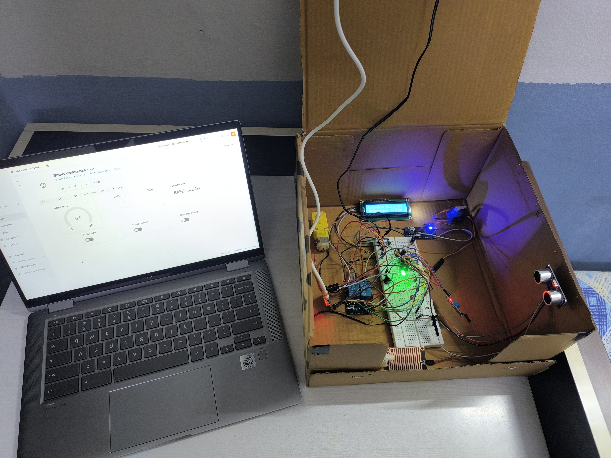

# Automated Underpass Waterlogging Detection & Control System

A smart, automated IoT and embedded system built on the **ESP32 microcontroller** platform. It is designed to detect rainfall, monitor real-time water accumulation levels, clear drainage blockages using a motorized conveyor mechanism, and automatically pump out water to prevent underpass flooding. The system enhances public road safety by deploying a servo-operated physical barricade to restrict vehicular entry during dangerous high-water conditions while providing real-time alerts via an LCD, status LEDs, and an audible buzzer.

## 📸 Project Media
Below is the physical hardware setup and circuit assembly for this project:

---

## 🛠️ System Components
The system architecture integrates the following core hardware elements managed by the primary microcontroller:

* **Microcontroller**: ESP32 Development Board — programmed via the main hardware firmware link ([Final.ino](./Final.ino))
* **Sensors**: Water level sensor / Ultrasonic sensor, Rain detection sensor module
* **Actuators & Controls**: Automated water extraction pump, High-torque conveyor motor, Servo-driven safety barricade
* **User Interface & Alerts**: Alphanumeric LCD display, Multi-color indicator LEDs, High-decibel audio buzzer

---

## ⚙️ How It Works
1. **Detection**: Rain and water level sensors constantly monitor environmental conditions inside the underpass.
2. **Mitigation**: If debris blocks the drainage system, the conveyor mechanism activates to clear it, and the submersed water pump begins extraction.
3. **Safety Intervention**: If water levels rise past a safe threshold, the system displays a warning message, sounds the buzzer, flashes the emergency red LEDs, and lowers the servo barricade to physically block oncoming traffic.
